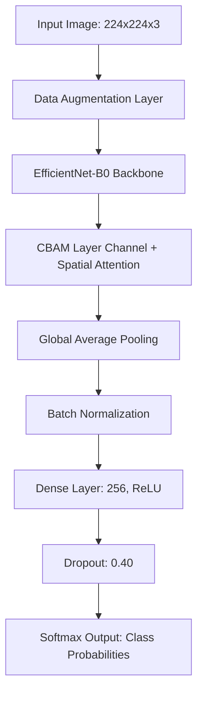

# Plant Identification System (EfficientNet-B0 + CBAM)

A production-grade, end-to-end computer vision and web application that classifies plant species using a custom deep learning pipeline. The project features a deep convolutional neural network built with transfer learning, an advanced dual-attention mechanism, a REST API for real-time predictions, and an interactive web interface.

---

## 🚀 Key Features

*   **State-of-the-Art Deep Learning Architecture**: Combines an **EfficientNet-B0** backbone with a custom **Convolutional Block Attention Module (CBAM)** for localized feature enhancement.
*   **Robust Data Augmentation Pipeline**: Integrates random spatial and color transformations directly into the TF/Keras model graph to combat overfitting.
*   **Two-Stage Model Training**: Consists of Feature Extraction (training the head) followed by fine-tuning select deeper layers of the backbone with custom learning rate schedules.
*   **Production-Ready REST API**: Built with **FastAPI** to support sub-second model inference, validation schemas, and real-time classification.
*   **Responsive Web Interface**: Modern, vanilla HTML/CSS/JavaScript client allowing users to upload images and instantly view predicted classes and confidence scores.
*   **Modular Codebase**: Organized directory structure distinguishing model development, data preprocessing, API routes, and client-side code.

---

## 🏗️ Architecture Overview

The core model architecture relies on transfer learning supplemented by spatial and channel attention mechanisms to focus on crucial plant patterns (e.g., leaf venation, shape, and spots).



### 🧠 Model Mechanics

1.  **Backbone Network**: EfficientNet-B0 pretrained on ImageNet acts as a rich feature extractor.
2.  **CBAM (Convolutional Block Attention Module)**:
    *   **Channel Attention**: Identifies *what* features are meaningful using Max and Average Pooling across spatial dimensions, followed by a shared Multi-Layer Perceptron (MLP).
    *   **Spatial Attention**: Identifies *where* features are meaningful using Max and Average Pooling along the channel dimension, followed by a 7x7 Conv2D layer.
3.  **Two-Stage Optimization**:
    *   **Stage 1: Feature Extraction**: Backbone is frozen. The attention layer and classification head are trained with `Adam(lr=1e-3)` for 8 epochs.
    *   **Stage 2: Fine-Tuning**: The top 30 layers of the EfficientNet backbone are unfrozen (with BatchNormalization layers kept frozen to avoid training instability). The model is optimized with `Adam(lr=1e-5)` for 15 epochs.

---

## 📁 Repository Structure

```text
plant-identification-cnn/
├── data/
│   ├── raw/                # Original class-nested images (e.g., raw/apple, raw/tomato)
│   └── processed/          # Train, validation, and test splits (automatically generated)
├── src/
│   ├── data/
│   │   ├── loader.py        # Data loading and pipeline initialization
│   │   └── preprocessing.py # Image preprocessing scripts
│   ├── model/
│   │   ├── cnn.py          # TF/Keras Model graph definitions (CBAM, Attention blocks)
│   │   ├── train.py        # Two-stage training controller
│   │   └── evaluate.py     # Evaluation functions and metrics calculations
│   ├── inference/
│   │   └── predictor.py    # Class to run inference on PIL images
│   └── utils/
│       └── config.py       # Global config parameters (image size, paths, thresholds)
├── models/
│   ├── plant_classifier.keras # Saved weights and model graph
│   ├── class_names.json       # JSON list mapping index to plant name
│   └── training_history.json  # Saved metrics over training epochs
├── api/
│   ├── main.py             # FastAPI entrypoint
│   ├── schemas.py          # Pydantic schemas for requests/responses
│   └── routes/
│       └── prediction.py   # Prediction endpoints
├── frontend/
│   ├── index.html          # Web application UI
│   ├── css/style.css       # Clean, modern custom stylesheet
│   └── js/app.js           # API communication and UI dynamics
├── tests/                  # Model, predictor, and API test suites
└── scripts/
    ├── prepare_dataset.py  # Script wrapper to split and prepare data
    ├── train_model.py      # Script wrapper to run model training
    └── evaluate_model.py   # Script wrapper to test and save metrics
```

---

## 🛠️ Setup and Installation

### 1. Prerequisites
Make sure you have **Python 3.8+** and `pip` installed.

### 2. Environment Setup
Clone the repository and initialize a virtual environment:

```bash
# Clone the repository
git clone https://github.com/Teletetra/Plant_identification_EfficientNet.git
cd Plant_identification_EfficientNet

# Create and activate virtual environment
python -m venv .venv
source .venv/bin/activate  # On Windows use: .venv\Scripts\activate

# Install dependencies
pip install -r requirements.txt
```

### 3. Environment Variables
Copy the template `.env.example` file to `.env` and adjust the variables as required:

```bash
cp .env.example .env
```

---

## ⚡ Step-by-Step Usage

### 1. Prepare the Dataset
Arrange your raw dataset images in class-nested folders under `data/raw/plant_images/`:
```text
data/raw/plant_images/
├── apple/
│   ├── img1.jpg
│   └── img2.jpg
├── potato/
│   ├── img3.jpg
│   └── img4.jpg
└── tomato/
    ├── img5.jpg
    └── img6.jpg
```
Run the preparation script to automatically split data into `train`, `validation`, and `test` directories:
```bash
python scripts/prepare_dataset.py
```

### 2. Train the Model
Train the model using the two-stage pipeline. The script automatically exports the best model checkpoint, class lists, and training history metrics:
```bash
python scripts/train_model.py
```

### 3. Evaluate the Model
Analyze performance metrics (Accuracy, Loss, Confusion Matrix, Classification Report) against the test set:
```bash
python scripts/evaluate_model.py
```

### 4. Launch the API Server
Start the FastAPI server using Uvicorn:
```bash
uvicorn api.main:app --reload
```
Access the interactive Swagger UI API documentation at [http://127.0.0.1:8000/docs](http://127.0.0.1:8000/docs).

### 5. Open the Web Frontend
To serve the frontend client locally, run a static server:
```bash
python -m http.server 5500 --directory frontend
```
Navigate to [http://127.0.0.1:5500](http://127.0.0.1:5500) to upload images and classify them in real-time.

---

## 🛡️ License and Notes

*   **Git Rules**: Raw images, splits, and Keras models (`.keras`) are excluded from tracking to keep the repository light.
*   **Verification**: Test suites are provided under `tests/`. Run them using `pytest` to verify predictor and model loading behavior.
